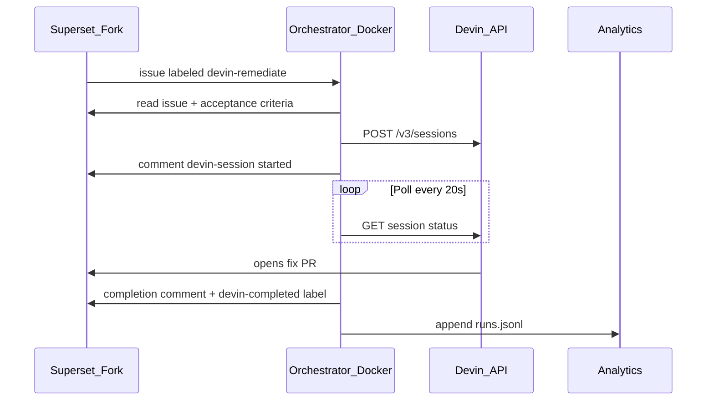

# Superset Devin Remediation Orchestrator

Dockerized automation that remediates scoped issues on an [Apache Superset](https://github.com/apache/superset) fork using the [Devin API](https://docs.devin.ai/api-reference/overview). Labeling a fork issue triggers the orchestrator, which dispatches Devin, posts status to GitHub, opens fix PRs, and records metrics for leadership reporting.

## Repositories

| Repository | URL | Role |
|------------|-----|------|
| **Solution** (this repo) | `sidshukla-github/superset-devin-remediation` | Docker orchestrator, webhook, analytics |
| **Superset fork** | [sidshukla-github/superset](https://github.com/sidshukla-github/superset) | Remediation issues + fix PRs |

## Take-home deliverables

| Task | What we built | Where to verify |
|------|---------------|-----------------|
| **Task 1 — Issues** | 4 scoped remediation issues on the fork | [docs/ISSUES.md](docs/ISSUES.md), [fork Issues](https://github.com/sidshukla-github/superset/issues) |
| **Task 2 — Automation** | Event-driven orchestrator (webhook + CLI) | Issue comments, Devin session, [PR #26](https://github.com/sidshukla-github/superset/pull/26) |
| **Task 3 — Analytics** | `runs.jsonl` + HTML/Markdown report | [reports/dashboard.html](reports/dashboard.html), `curl /report?format=html` |

## Architecture



**Verified live remediation:**

- Issue: [#25 — [Demo] Enable manual trigger for dependency-review workflow](https://github.com/sidshukla-github/superset/issues/25)
- PR: [#26 — ci(dependency-review): enable manual workflow dispatch](https://github.com/sidshukla-github/superset/pull/26)
- Label: `devin-completed`

---

## Prerequisites

| Path | Requirements |
|------|----------------|
| **Simulate** (no credentials) | Docker + Docker Compose only |
| **Live** | Devin service user key (`cog_...`), org ID, GitHub PAT with **Issues: Read/Write** on the fork |
| **Webhook** (optional) | Public tunnel (localtunnel/ngrok) — GitHub cannot reach `localhost` |

---

## Reviewer quick start — Simulate (5 minutes, no API keys)

Exercises the full orchestration path without calling Devin or GitHub.

```bash
git clone https://github.com/sidshukla-github/superset-devin-remediation.git
cd superset-devin-remediation

docker compose --profile cli build
docker compose --profile cli run --rm cli simulate --issue 25
docker compose --profile cli run --rm cli report --format html > reports/dashboard.html
open reports/dashboard.html   # macOS; or open the file in a browser
```

**Expected outputs:**

- Terminal prints a JSON remediation record
- `data/runs.jsonl` gains a new row
- `reports/dashboard.html` shows success rate, throughput, and recent runs

**Alternative — HTTP report** (with service running):

```bash
docker compose up --build -d
curl http://localhost:8080/health
open "http://localhost:8080/report?format=html"
```

---

## Live workflow — CLI trigger (recommended)

Create a fresh demo issue (or pick an open labeled issue on the fork):

```bash
./scripts/create_issues.sh   # note the issue number from the output (e.g. #27)
```

```bash
cp .env.example .env
# Edit .env: DEVIN_API_KEY, DEVIN_ORG_ID, GITHUB_TOKEN
# If Docker SSL errors (e.g. Zscaler proxy): DEVIN_SSL_VERIFY=false

docker compose --profile cli build
docker compose --profile cli run --rm cli verify
docker compose --profile cli run --rm cli remediate --issue 27   # your issue number
```

**If a PR opens but `devin-completed` label is missing** (Devin session still `running`):

```bash
docker compose --profile cli run --rm cli finalize --issue 27   # your issue number
```

**What to check on the fork:**

1. Issue comment: `devin-session: <id>` with link to [app.devin.ai](https://app.devin.ai)
2. Completion comment with PR URL
3. Label `devin-completed` or `devin-failed`
4. Fix PR on the fork

**Process all unprocessed labeled issues:**

```bash
docker compose --profile cli run --rm cli poll
```

---

## Live workflow — Webhook trigger (optional)

Use this to demonstrate event-driven automation without manual CLI commands.

1. Start the service:

   ```bash
   docker compose up --build
   ```

2. Expose port 8080 (GitHub cannot reach `localhost`):

   ```bash
   npx localtunnel --port 8080
   ```

3. Configure webhook on the [fork](https://github.com/sidshukla-github/superset/settings/hooks):
   - **Payload URL**: `https://<tunnel-host>/webhooks/github` (note: `webhooks`, plural)
   - **Content type**: `application/json` or `application/x-www-form-urlencoded`
   - **Secret**: same as `WEBHOOK_SECRET` in `.env`
   - **Events**: Issues

4. Re-trigger an issue: remove `devin-remediate` label and add it back. Alternatively, run `./scripts/create_issues.sh` to create a new demo issue (adds the label automatically).

5. Verify:
   - Fork → Settings → Webhooks → Recent Deliveries → **200**
   - `docker compose logs -f remediation`

---

## Analytics and reporting (Task 3)

**Question: "How do I know this is working?"**

| Metric | Where |
|--------|-------|
| Active vs completed tasks | Dashboard cards: "Active sessions" vs "Completed (success)" / "Failed" |
| Success/failure signals | `success: true/false` in `data/runs.jsonl`; `devin-completed` / `devin-failed` labels on issues |
| Throughput / progress | Dashboard "Throughput (last 7 days)" table; per-run rows in `runs.jsonl` |
| Audit trail | `data/runs.jsonl` — one JSON object per remediation run |

**View reports:**

```bash
# HTML dashboard (best for reviewers)
docker compose --profile cli run --rm cli report --format html > reports/dashboard.html
open reports/dashboard.html

# Markdown in terminal
docker compose --profile cli run --rm cli report

# JSON
docker compose --profile cli run --rm cli report --format json

# HTTP (service must be running)
curl "http://localhost:8080/report?format=html" > reports/dashboard.html
```

---

## How to verify each requirement

| Requirement | Check |
|-------------|-------|
| Event trigger | Webhook delivery 200, or `remediate` / `poll` CLI log |
| Devin session initiated | Issue comment with `devin-session:` and Devin URL |
| Session managed | Orchestrator polls until terminal or PR + finished; completion comment posted |
| Observable outputs | PR on fork, issue comments, `data/runs.jsonl`, `/report` |
| Active sessions | Dashboard "Active sessions" card (live Devin API when not dry-run) |
| Success rate | Dashboard "Success rate" card; `success` field in `runs.jsonl` |

---

## CLI reference

All commands run via Docker:

```bash
docker compose --profile cli run --rm cli <command>
```

| Command | Description |
|---------|-------------|
| `simulate --issue N` | Dry-run remediation (no API calls) |
| `remediate --issue N` | Start live Devin session for issue N |
| `finalize --issue N` | Apply completion comment/label from existing session (e.g. after PR opens) |
| `poll` | Process all open `devin-remediate` issues without a session comment |
| `report` | Print metrics report (markdown) |
| `report --format json` | Print metrics as JSON |
| `report --format html` | Print HTML dashboard |
| `verify` | Test Devin API credentials |

---

## Environment variables

Copy [`.env.example`](.env.example) to `.env`.

| Variable | Required | Description |
|----------|----------|-------------|
| `DEVIN_API_KEY` | Live runs | Devin service user key (`cog_...`) |
| `DEVIN_ORG_ID` | Live runs | Devin organization ID |
| `GITHUB_TOKEN` | Live runs | GitHub PAT; **Issues: Read/Write** on fork (fine-grained) or `public_repo` (classic) |
| `TARGET_REPO` | No | Default: `sidshukla-github/superset` |
| `WEBHOOK_SECRET` | Webhooks | HMAC secret matching fork webhook settings |
| `REMEDIATION_LABEL` | No | Default: `devin-remediate` |
| `MAX_ACU_LIMIT` | No | Per-session ACU cap (default: 15) |
| `TERMINATE_SESSION_ON_PR` | No | `true` (default): archive Devin session when PR opens |
| `TERMINATE_SESSION_ARCHIVE` | No | `true` (default): keep terminated session visible in Devin UI |
| `HTTP_SSL_VERIFY` | No | Set `false` behind SSL-inspecting proxies |
| `DEVIN_SSL_VERIFY` | No | Legacy alias; `false` disables TLS verify for GitHub + Devin |
| `DRY_RUN` | No | Set `true` to skip all API calls |

---

## Creating issues on the fork (Task 1)

Issue templates and scope are documented in [docs/ISSUES.md](docs/ISSUES.md).

Create all four issues with one command (requires `gh` CLI):

```bash
./scripts/create_issues.sh
```

Or create manually on [sidshukla-github/superset/issues](https://github.com/sidshukla-github/superset/issues) using the templates in `docs/ISSUES.md`. Each issue needs label `devin-remediate`.

---

## Project structure

```
.
├── Dockerfile
├── docker-compose.yml
├── orchestrator/
│   └── src/remediation/
│       ├── main.py           # FastAPI webhook + /health + /report
│       ├── orchestrator.py   # Core remediation + finalize flow
│       ├── devin_client.py   # Devin API v3 client
│       ├── github_client.py  # GitHub issue comments/labels
│       ├── metrics.py        # runs.jsonl + HTML/Markdown reporting
│       └── cli.py            # CLI entrypoint
├── scripts/
│   ├── create_issues.sh      # Create fork issues via gh CLI
│   └── issue-bodies/         # Issue body templates
├── docs/
│   └── ISSUES.md             # Issue index + templates
├── reports/
│   └── dashboard.html        # Sample HTML dashboard output
└── data/
    └── runs.jsonl            # Metrics audit log (volume-mounted)
```

---

## Troubleshooting

| Problem | Solution |
|---------|----------|
| GitHub rejects `localhost` webhook URL | Use `npx localtunnel --port 8080` or run CLI `remediate` / `poll` instead |
| Wrong webhook path | Must be `/webhooks/github` (plural), not `/webhook/github` |
| SSL errors in Docker (`CERTIFICATE_VERIFY_FAILED`) | Set `DEVIN_SSL_VERIFY=false` in `.env` (common behind Zscaler) |
| Devin `403 out_of_quota` | Resolve billing in Devin settings; use `simulate` for demo |
| PR exists but session still `running` in Devin | Orchestrator auto-terminates on PR (default). Run `finalize --issue N` if webhook path skipped polling |
| PR exists but no `devin-completed` label | Run `finalize --issue N` |
| Two Devin sessions / two PRs for one issue | Caused by `issues.opened` + `issues.labeled` both firing; fixed in latest orchestrator. Rebuild: `docker compose up --build`. Use updated `create_issues.sh` (adds `devin-remediate` after create) |
| Issues created but nothing triggered | Creating issues does not retroactively fire webhooks; re-label or run `poll` |
| `code-quality` label not found | Run updated `create_issues.sh` (creates all required labels first) |

---

## Submission checklist

- [x] Solution repo with Docker setup and this README
- [x] Fork at [sidshukla-github/superset](https://github.com/sidshukla-github/superset) with remediation issues
- [x] Live remediation: [issue #25](https://github.com/sidshukla-github/superset/issues/25) → [PR #26](https://github.com/sidshukla-github/superset/pull/26)
- [x] Analytics: `data/runs.jsonl` + [reports/dashboard.html](reports/dashboard.html)
- [x] Reviewer can simulate: `docker compose --profile cli run --rm cli simulate --issue 25`
